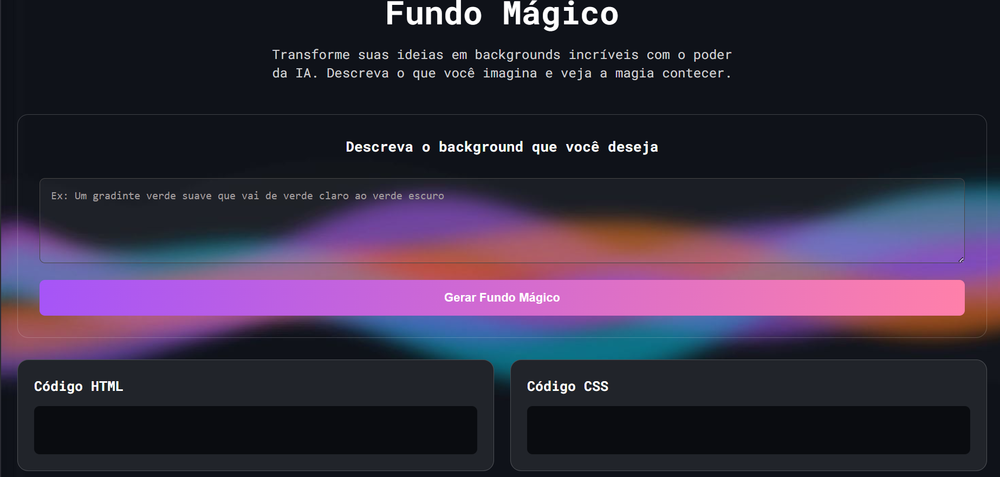

# 🚀 Projeto DevEmDobro - Semana do Zero ao Programador Contratado

<p align="center">
  
  
  
  
</p>

> **Status do Projeto:** Finalizado ✅

---

## 💻 Sobre o Projeto

Este projeto foi desenvolvido durante a **"Semana do Zero ao Programador Contratado"**, um evento focado em ensinar as bases sólidas do desenvolvimento web. 

Trata-se de uma landing page interativa que coloca em prática os conceitos fundamentais de front-end. O foco principal foi criar uma interface limpa, com boa experiência de usuário (UX) e totalmente adaptável para dispositivos móveis.

---

## 📸 Demonstração



---

## 🛠️ Tecnologias e Aprendizados

Neste projeto, mergulhei profundamente em:

* **HTML5 Semântico:** Organização de conteúdo de forma acessível e otimizada para SEO.
* **CSS3 Avançado:**
    * Uso de variáveis para cores.
    * **Responsividade:** Criação de um layout que se adapta a celulares, tablets e desktops (Mobile First).
    * Organização de arquivos (separação de reset, estilos principais e media queries).
* **JavaScript Moderno:** Manipulação do DOM para criar interatividade (como abrir/fechar abas, menus ou troca de temas).

---

## 📂 Estrutura de Pastas

```text
├── index.html          # Ponto de entrada (Estrutura)
├── src/
│   ├── css/
│   │   ├── estilos.css     # Estilização global
│   │   ├── reset.css       # Limpeza de estilos padrões dos browsers
│   │   └── responsivo.css  # Ajustes para diferentes telas
│   ├── images/             # Assets visuais
│   └── js/
│       └── index.js        # Lógica de interatividade
